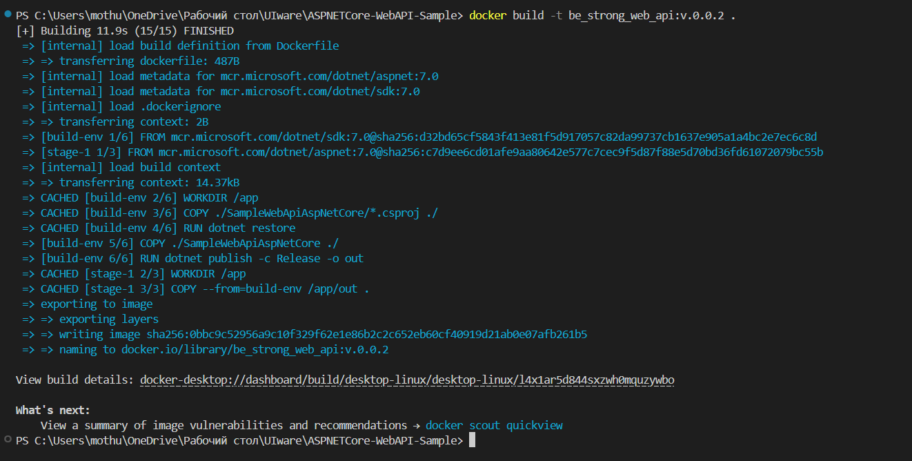
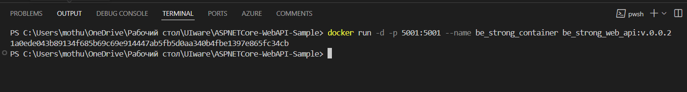
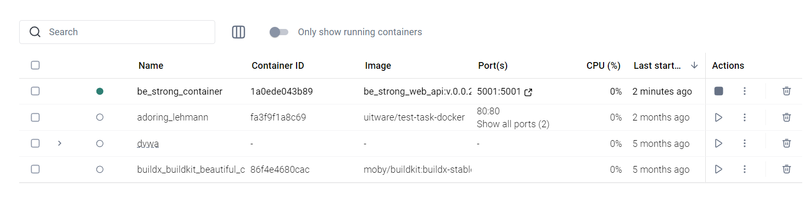
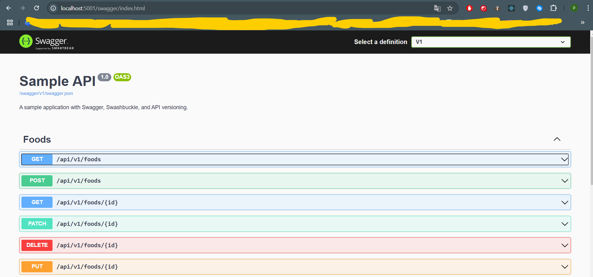
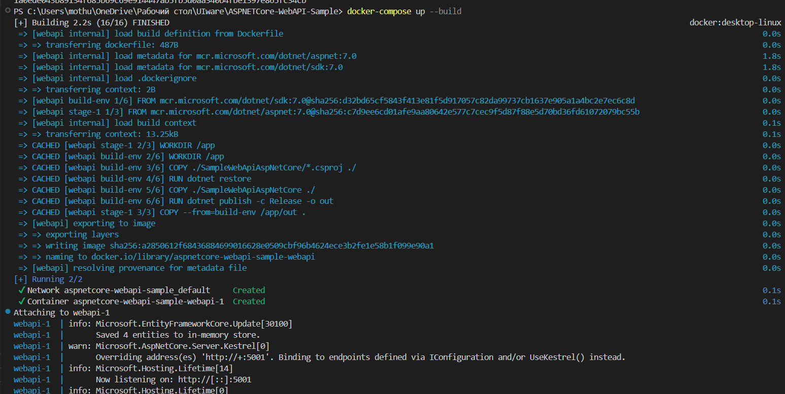
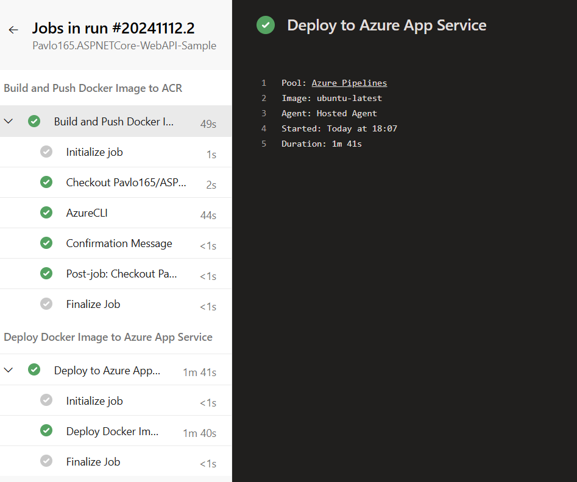
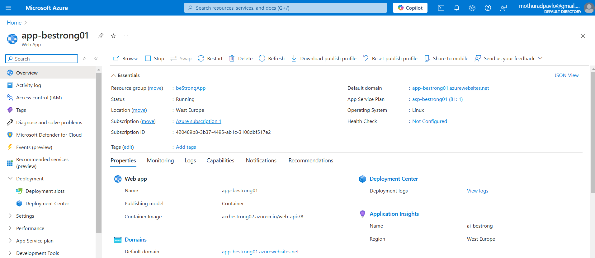
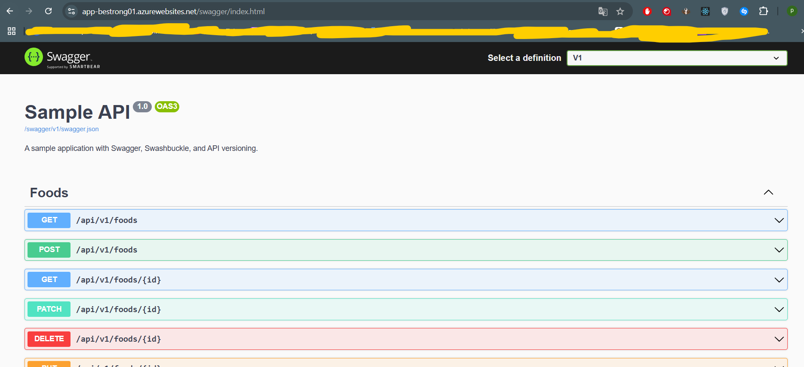

# Docker CI/CD

## Local Application Testing

To run the application locally, I cloned it to my PC and made minor adjustments to ensure it functioned correctly in the local environment.

### Changes Made:
1. **Configuration for HTTP**: Modified the `appsettings.json` file to work over HTTP, as the application will be hosted on an app service that encrypts traffic automatically.

    ```json
    "Kestrel": {
      "Endpoints": {
        "Http": {
          "Url": "http://+:5001"
        }
      }
    }
    ```

2. **Program.cs Modification**: Commented out the HTTPS redirection line in `Program.cs`:

    ```csharp
    // app.UseHttpsRedirection();
    ```

After these changes, I ran the application locally. Once I confirmed it was working properly, I proceeded to containerization.


## Containerizing an Application

Instructions for containerizing the application are stored in a **Dockerfile**. The build consists of two stages:
- **Compile Stage**: Uses a `dotnet/sdk` image.
- **Run Stage**: Uses an `aspnet` image.

- **Running docker build**  
  

- **Running docker run**  
  

- **Docker Desktop Interface**  
  

- **Browser Window at localhost:5001/swagger**  
  

Also tested deploying the container using docker-compose. The code is stored in docker-compose.yml

- **Running docker-compose**
   

## Terraform Code Change

To deploy containers on App Service, I made changes to the Terraform code. Namely, I changed the operating system to Linux and the Publish mode to container.

### App Service Plan
```hcl
resource "azurerm_app_service_plan" "app_plan" {
  name                = "asp-bestrong01"
  location            = azurerm_resource_group.rg.location
  resource_group_name = azurerm_resource_group.rg.name
  kind                = "Linux"
  reserved            = true

  sku {
    tier = "Basic"
    size = "B1"
  }
}

# App Service
resource "azurerm_app_service" "app" {
  name                = "app-bestrong01"
  location            = azurerm_resource_group.rg.location
  resource_group_name = azurerm_resource_group.rg.name
  app_service_plan_id = azurerm_app_service_plan.app_plan.id

  identity {
    type = "SystemAssigned"
  }
  app setting = {....}
  site_config{
    linux_fx_version = "DOCKER|nginx:latest"
  }
}
```

The nginx:latest image was used for testing. After running the docker ci/cd pipeline, it will be replaced with an image with an asp application.

## Docker CI/CD Pipeline

The pipeline code is stored in `.github/workflow/ci_cd.yml`. The pipeline is divided into two stages:

1. **Build**
2. **Deploy**

During the build stage, the container is built and the finished image is uploaded to the azure container registry, which was deployed using terrafrom. During the Deploy stage, the image is delivered from the container registry and deployed to the App service.

## Result of ci/cd execution.

- **Screenshot of successful deployment on AzureDevOps.**
   

- **App service tab in the Azure portal**
   

- **Deployed application in App service**
  
  
